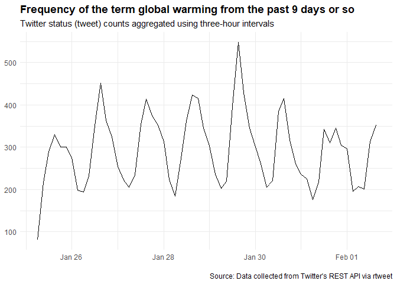
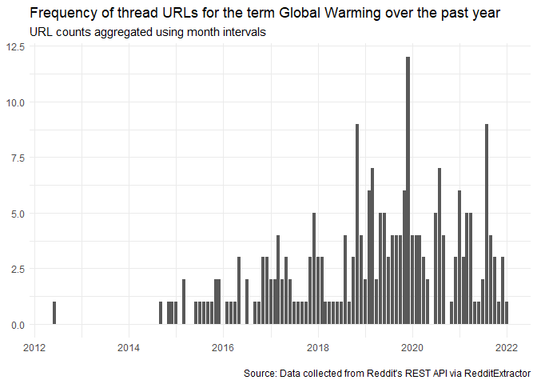
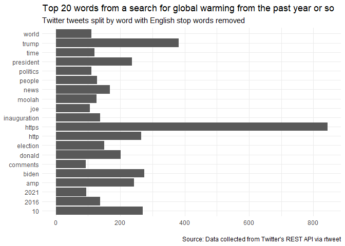
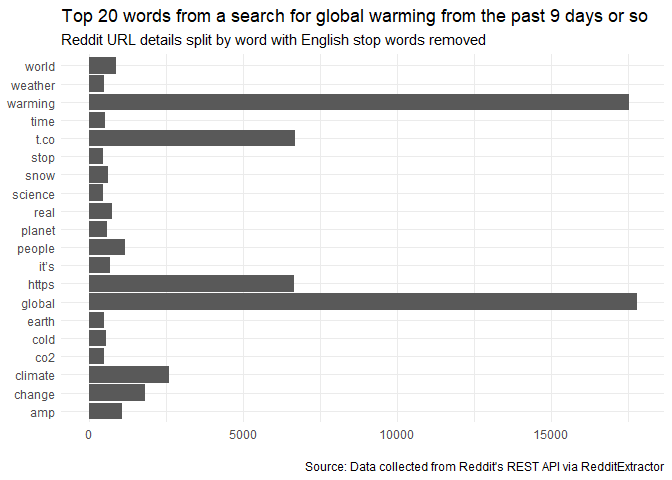

[](https://zenodo.org/badge/latestdoi/454447997)

CDI: Introductory Social Media data collection and Analysis
================
James Tripp
01/02/2022

## Social media collection and analysis

Here we will collect and summarise data from two social media platforms:
Twitter and Reddit. The goal is for you to become familiar with the R
language and be able to run your own queries. What is a good query and
how does one best analyse data will depend on your own research
interests. There is time in this session to discuss those things.

## What you need

-   R and RStudio installed on your computer

-   A twitter account (if you want to download tweets)

## Social media

Social media data is used throughout Academia. For example, one can look
at Digital Humanities communities (Grandjean 2016) or carry out
controversy analysis (Marres and Moats 2015) .

## Libraries

We need additional libraries to do things like download tweets and
Reddit posts. Running the cell below (by pressing the green play button)
will tell R to download the libraries we need.

``` r
install.packages('rtweet')
install.packages('RedditExtractoR')
```

Let us load these libraries into R.

## Downloading data

Twitter and Reddit are quite different platforms.

-   On Twitter, you can do things such as follow a single user/bot or
    search for terms.

-   On Reddit, people post links on subreddits which are voted and
    commented on.

Both the structure of and communities on the platforms differ. For
example, compare a search for global warming on both platforms.

-   [Global warming search on
    Twitter](https://twitter.com/search?q=global%20warming&src=typed_query)

-   [Global warming search on
    Reddit](https://www.reddit.com/search/?q=global%20warming)

I will be using the search term ‘global warming.’ If you would like to
use a different term then change it in the cell below.

``` r
query <- 'global warming'
```

Run the data below to collect tweets and links for global warming.

    ## parsing URLs on page 1...
    ## parsing URLs on page 2...
    ## parsing URLs on page 3...

What do the first three lines tell us?

``` r
head(df_twitter$text[1:3])
```

    ## [1] "i thought it was global WARMing not colding <U+0001F62D>"                                                                                                                                                                                   
    ## [2] "Global warming is REAL. The Rock frying like a sunny side up egg im crying https://t.co/k2x7Mhyf0S"                                                                                                                                         
    ## [3] "@shadeyxo @cthequeen88 Thinking we’re in a pandemic and global warming should be the reason to not have kids cause  <U+0001F923><U+0001F923> God isn’t going to destroy this earth he going to destroy bad people so if your a bad person don’t have children !"

``` r
df_reddit$title[1:3]
```

    ## [1] "Help me create a comprehensive open source hydroponics guide."                                
    ## [2] "When Male/Female Difference Deniers Think They Can Detect Global Warming, We\031re In Trouble"
    ## [3] "Evidence That Antarctica Is Cooling, Not Warming"

## Close reading

There are a few hundreds rows in our datasets. Let us take 10 minutes to
look at our data closely. You can look at the full result by clicking on
the table button in the environment panel. We can do the same using the
function View.

``` r
View(df_twitter)
```

``` r
View(df_reddit)
```

Take some time on your own or with a colleague to look at the data
closely. We will come back together and discuss as a group in 10 minutes
to consider the following questions:

-   What have you found out about your query?

-   What differences are there between platforms?

-   How is the data limited?

### APIs

Our data is collected using APIs for the different platforms. The term
Application Programming Interface (API) sounds fancy. In practice, it
describes sending some options, such as a search term, to a location
(such as web address) and a system sending back some data in a machine
readable format (usually JSON). The libraries handles taking our options
(e.g., our query), sending the request over the web, then receiving and
shaping the data into a format we can use (a data frame).

APIs control the amount and type of data you can collect. The
search_tweets function uses an API which collects data from the past 7
days. If you want more data then you will need to sign up for the
enterprise or Academic Track accounts. The find_thread_url function
queries the Reddit front page and does not need authentication (see the
result for global warming and 100 responses
[here](https://www.reddit.com/search.json?q=global+warming&sort=top&t=month&limit=100)).

The topic of APIs and their impact on research is an interesting topic.
For example, Twitter is often studied because the data is very
accessible. However, other platforms such as Tik Tok, YouTube or Weibo
may be less studied because the APIs are restrictive. An API can also
change over time and the nature of the data collected my be different as
new feature are released. Also, how much do you know about the data
selection processes via the API and can you validate the robustness of
the data? How to go beyond APIs into a ‘post-API environment’ is an
ongoing discussion (Perriam, Birkbak, and Freeman 2020) .

## More libraries

We are going to use the popular [tidyverse set of
packages](https://www.tidyverse.org/). The tidyverse helps make tasks a
bit easier and is commonly used in data science with R.

``` r
install.packages('tidyverse')
```

``` r
library(tidyverse)
```

    ## -- Attaching packages --------------------------------------- tidyverse 1.3.1 --

    ## v ggplot2 3.3.5     v purrr   0.3.4
    ## v tibble  3.1.6     v dplyr   1.0.7
    ## v tidyr   1.1.4     v stringr 1.4.0
    ## v readr   2.1.1     v forcats 0.5.1

    ## -- Conflicts ------------------------------------------ tidyverse_conflicts() --
    ## x dplyr::filter()  masks stats::filter()
    ## x purrr::flatten() masks rtweet::flatten()
    ## x dplyr::lag()     masks stats::lag()

## Timeline

Plotting the Twitter data over time is straight forward. We can use the
code from the [rtweet page](https://github.com/ropensci/rtweet). We will
also collect more tweet by increasing the n parameter to 18000.

``` r
rt <- search_tweets(query, n = 18000, include_rts = FALSE)
```

    ## Warning: Rate limit exceeded - 88

    ## Warning: Rate limit exceeded

``` r
rt %>%
  ts_plot("3 hours") +
  ggplot2::theme_minimal() +
  ggplot2::theme(plot.title = ggplot2::element_text(face = "bold")) +
  ggplot2::labs(
    x = NULL, y = NULL,
    title = "Frequency of the term global warming from the past 9 days or so",
    subtitle = "Twitter status (tweet) counts aggregated using three-hour intervals",
    caption = "\nSource: Data collected from Twitter's REST API via rtweet"
  )
```

<!-- -->

The Reddit data is a little trickier but doable. First, we collect a bit
more data.

``` r
r <- find_thread_urls(query, period = 'all')
```

    ## parsing URLs on page 1...
    ## parsing URLs on page 2...
    ## parsing URLs on page 3...

It looks like the Reddit api or the Reddit package collects 3 pages, no
more. We have \~240 Reddit posts which span a longer period. If we had
more time then we might look into finding another dataset with more
information.

Creating a timeline is a little trickier but doable.

``` r
r <- r |>
  mutate(date = lubridate::ymd(date_utc))
```

``` r
r %>%
  mutate(time = lubridate::floor_date(date,
                          unit = 'month')
         ) %>%
  group_by(time) %>%
  summarise(n = n()) %>%
  ggplot2::ggplot(aes(x=time, y=n)) +
  ggplot2::theme_minimal() +
  ggplot2::geom_col(pos = 'dodge') +
  ggplot2::labs(
  x = NULL, y = NULL,
  title = "Frequency of thread URLs for the term Global Warming over the past year",
  subtitle = "URL counts aggregated using month intervals",
  caption = "\nSource: Data collected from Reddit's REST API via RedditExtractor"
  )
```

<!-- -->

## Word Frequency

Our final library contains some functions useful for text.

``` r
install.packages('tidytext')
```

``` r
library(tidytext)
```

We can separate and count the words in our data. From these words we
remove the most common words and count the occurrence of each word.

``` r
data("stop_words")
r %>%
  select(text) %>%
  unnest_tokens(word, text) %>%
  anti_join(stop_words) %>%
  count(word, sort=TRUE) %>%
  head()
```

    ## Joining, by = "word"

    ##    word   n
    ## 1 https 844
    ## 2 trump 381
    ## 3 biden 275
    ## 4    10 270
    ## 5  http 265
    ## 6   amp 243

What does the Twitter data tell us?

``` r
rt %>%
  select(text) %>%
  unnest_tokens(word, text) %>%
  anti_join(stop_words) %>%
  count(word, sort=TRUE) %>%
  head()
```

    ## Joining, by = "word"

    ## # A tibble: 6 x 2
    ##   word        n
    ##   <chr>   <int>
    ## 1 global  17781
    ## 2 warming 17529
    ## 3 t.co     6676
    ## 4 https    6665
    ## 5 climate  2596
    ## 6 change   1827

``` r
r %>%
  select(text) %>%
  unnest_tokens(word, text) %>%
  anti_join(stop_words) %>%
  count(word, sort=TRUE) %>%
  top_n(20) %>%
  ggplot(aes(x=word, y=n)) +
  ggplot2::theme_minimal() +
  ggplot2::geom_col(pos = 'dodge') +
  ggplot2::coord_flip() +
  ggplot2::labs(
    x = NULL, y = NULL,
    title = "Top 20 words from a search for global warming from the past year or so",
    subtitle = "Twitter tweets split by word with English stop words removed",
    caption = "\nSource: Data collected from Twitter's REST API via rtweet"
  )
```

    ## Joining, by = "word"

    ## Selecting by n

<!-- -->

``` r
rt %>%
  select(text) %>%
  unnest_tokens(word, text) %>%
  anti_join(stop_words) %>%
  count(word, sort=TRUE) %>%
  top_n(20) %>%
  ggplot(aes(x=word, y=n)) +
  ggplot2::theme_minimal() +
  ggplot2::geom_col(pos = 'dodge') +
  ggplot2::coord_flip() +
  ggplot2::labs(
    x = NULL, y = NULL,
    title = "Top 20 words from a search for global warming from the past 9 days or so",
    subtitle = "Reddit URL details split by word with English stop words removed",
    caption = "\nSource: Data collected from Reddit's REST API via RedditExtractor"
  )
```

    ## Joining, by = "word"

    ## Selecting by n

<!-- -->

## Going further

These links may be helpful if you want to do more with R:

-   [R basics with tabular
    data](https://programminghistorian.org/en/lessons/r-basics-with-tabular-data)

-   [Basic text processing with
    R](https://programminghistorian.org/en/lessons/basic-text-processing-in-r)

-   [Data wrangling and management in
    R](https://programminghistorian.org/en/lessons/data_wrangling_and_management_in_R)

-   [Text Mining with R](https://www.tidytextmining.com/) - a rather
    nice book using the TidyText package (as we did above)

-   [R for Data Science](https://r4ds.had.co.nz/) - one of the main
    books detailing how to use the Tidyverse package in a data science
    workflow

-   [R Graph Gallery](https://www.r-graph-gallery.com/)- A rather nice
    collection of visualisations and associated R code

There are also excellent books which details how to use R in a
Humanities context. Jockers and Thalken (2014) is quite readable with
some good examples. Arnold and Tilton (2015) offers a discussion of some
of the different situations where one might use R in the Humanities.

## References

<div id="refs" class="references csl-bib-body hanging-indent">

<div id="ref-arnold2015" class="csl-entry">

Arnold, Taylor, and Lauren Tilton. 2015. “Humanities Data in r.”
*Exploring Networks, Geospatial Data, Images, and Text*.

</div>

<div id="ref-grandjean2016a" class="csl-entry">

Grandjean, Martin. 2016. “A Social Network Analysis of Twitter: Mapping
the Digital Humanities Community.” Edited by Aaron Mauro. *Cogent Arts &
Humanities* 3 (1): 1171458.
<https://doi.org/10.1080/23311983.2016.1171458>.

</div>

<div id="ref-jockers2014" class="csl-entry">

Jockers, Matthew Lee, and Rosamond Thalken. 2014. *Text Analysis with r
for Students of Literature*. Springer.

</div>

<div id="ref-marres2015a" class="csl-entry">

Marres, Noortje, and David Moats. 2015. “Mapping Controversies with
Social Media: The Case for Symmetry.” *Social Media + Society* 1 (2):
2056305115604176. <https://doi.org/10.1177/2056305115604176>.

</div>

<div id="ref-perriam2020a" class="csl-entry">

Perriam, Jessamy, Andreas Birkbak, and Andy Freeman. 2020. “Digital
Methods in a Post-API Environment.” *International Journal of Social
Research Methodology* 23 (3): 277–90.
<https://doi.org/10.1080/13645579.2019.1682840>.

</div>

</div>
